:img-size: 200
:toc: macro
++++

++++
= Colletions of Image Generation Models

image:https://img.shields.io/badge/-Python 3.7--3.9-blue?style=for-the-badge&logo=python&logoColor=white[python, link=https://pytorch.org/get-started/locally/]
image:https://img.shields.io/badge/-PyTorch 1.8+-ee4c2c?style=for-the-badge&logo=pytorch&logoColor=white[pytorch, link=https://pytorch.org/]
image:https://img.shields.io/badge/-Lightning 1.3+-792ee5?style=for-the-badge&logo=pytorchlightning&logoColor=white[pytorch_lignthing, link=https://www.pytorchlightning.ai/]
image:https://img.shields.io/badge/config-hydra 1.1-89b8cd?style=for-the-badge&labelColor=gray[hydra, link=https://hydra.cc/]

An easily scalable and hierachical framework including lots of image generation method with various datasets.

++++

   
++++

Highlights 💡:
[Highlights:]
* Various types of image generation methods(__Continuous updating__): 
** GANs: WGAN, InfoGAN, BiGAN
** VAEs: VQ-VAE, Beta-VAE, FactorVAE
** Augoregressive Models: PixelCNN
** Diffusion Models: DDPM
* Decomposition of model training, datasets and networks:
+
[source, bash]
----
python run.py model=wgan networks=conv64 datamodule=celeba exp_name=wgan/celeba_conv64
----
* Hierachical configuration of experiment in yaml file
** Manual change of configs in `configs/model`, `configs/datamodule` and `configs/networks`
** Run predefined experiments in `configs/experiment`
+
[source, bash]
----
python run.py experiment=vanilla_gan/cifar10
----
** Override hyperparameters from command line
+
[source, bash]
----
python run.py experiment=vanilla_gan/cifar10 model.lrG=1e-3 model.lrD=1e-3 exp_name=vanilla_gan/custom_lr
----
* Run multiple experiments at the same time:
** Grid search of hyperparameters:
+
[source, bash]
----
python run.py experiment=vae/mnist_conv model.lr=1e-3,5e-4,1e-4 "exp_name=vae/lr_${model.lr}"
----
** Run multiple experiments from config files:
+
[source, bash]
----
python run.py -m experiment=vae/mnist_conv,vae/cifar10,vae/celeba
----

== Setup

* Clone this repo
+
[source, bash]
----
git clone https://github.com/Victarry/Image-Generation-models.git
----
* Create new python environment using conda and install requirements
+
[source, bash]
----
conda env create -n image-generation python=3.8
conda activate image-generation
pip install requirement.txt
----
* Run your first experiment ✔️
+
[source, bash]
----
python run.py experiment=vae/mnist
----

For different datasets, refer to documentation of datasets.

== Project Structure

== Generative Adversarial Networks(GANs)

=== GAN
*_Generative adversarial nets._* +
Ian J. Goodfellow, Jean Pouget-Abadie, Mehdi Mirza, Bing Xu, David Warde-Farley, Sherjil Ozair, Aaron Courville, Yoshua Bengio* +
NeurIPS 2014. [https://arxiv.org/abs/1406.2661[PDF]] [https://arxiv.org/abs/1701.00160[Tutorial]]

[cols="4*", options="header"] 
|===
^| Dataset
^| MNIST
^| CelebA
^| CIFAR10

^.^| Results
| 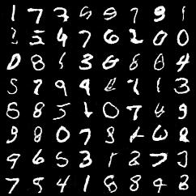
| 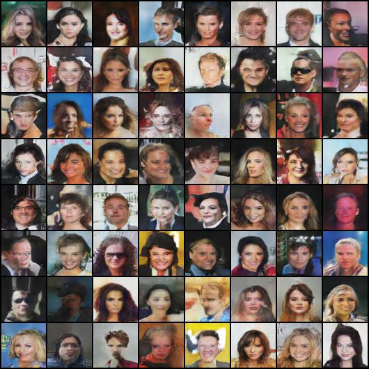
| 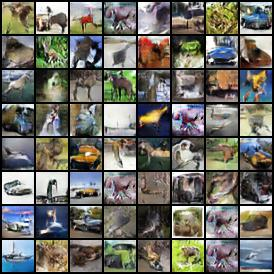
|===

=== LSGAN
*_Least Squares Generative Adversarial Networks._* +
Xudong Mao, Qing Li, Haoran Xie, Raymond Y.K. Lau, Zhen Wang, Stephen Paul Smolley. +
ICCV 2017. [https://arxiv.org/abs/1611.04076[PDF]]

[cols="4*", options="header"] 
|===
^| Dataset
^| MNIST
^| CelebA
^| CIFAR10

^.^| Results
| 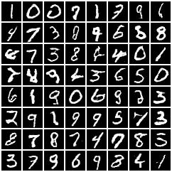
| 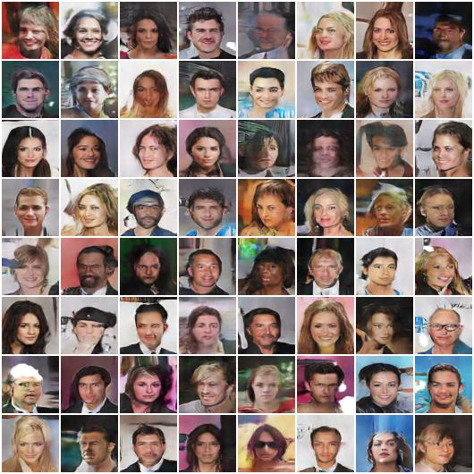
| 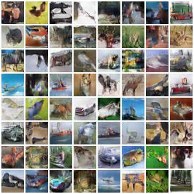
|===

=== WGAN
*_Wasserstein GAN_* +
Martin Arjovsky, Soumith Chintala, Léon Bottou. +
ICML 2017. [https://arxiv.org/abs/1701.07875[PDF]]

[cols="4*", options="header"] 
|===
^| Dataset
^| MNIST
^| CelebA
^| CIFAR10

^.^| Results
| 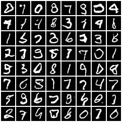
| 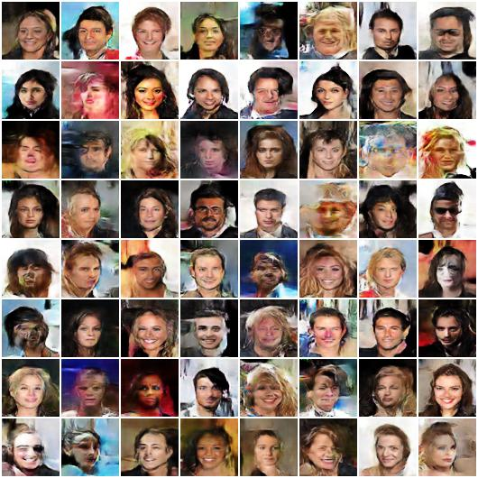
| 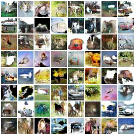
|===

=== WGAN-GP
*_Improved training of wasserstein gans_* +
Ishaan Gulrajani, Faruk Ahmed, Martin Arjovsky, Vincent Dumoulin, Aaron Courville +
NeurIPS 2017. [https://arxiv.org/abs/1704.00028[PDF]]
[cols="4*", options="header"] 
|===
^| Dataset
^| MNIST
^| CelebA
^| CIFAR10

^.^| Results
| 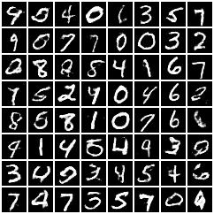
| 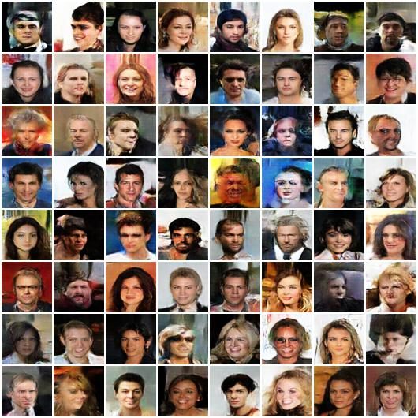
| 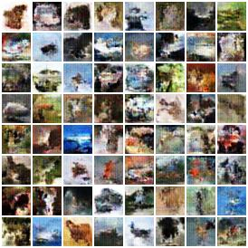
|===

=== VAE-GAN
*_Autoencoding beyond pixels using a learned similarity metric._* +
Anders Boesen Lindbo Larsen, Søren Kaae Sønderby, Hugo Larochelle, Ole Winther. +
ICML 2016. [https://arxiv.org/abs/1512.09300[PDF]]

[cols="4*", options="header"] 
|===
^| Dataset
^| MNIST
^| CelebA
^| CIFAR10

^.^| Results
| 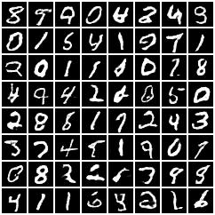
| 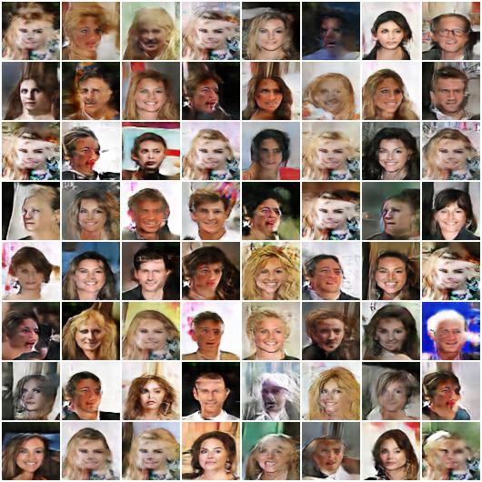
| 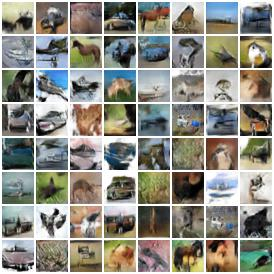
|===

=== BiGAN/ALI
`BiGAN` *_Adversarial Feature Learning_* +
_Jeff Donahue, Philipp Krähenbühl, Trevor Darrell._ +
ICLR 2017. [https://arxiv.org/abs/1605.09782[PDF]]

`ALI` *_Adversarial Learned Inference_* +
_Vincent Dumoulin, Ishmael Belghazi, Ben Poole, Olivier Mastropietro, Alex Lamb, Martin Arjovsky, Aaron Courville_ + 
ICLR 2017. [https://arxiv.org/abs/1606.00704[PDF]]

[cols="4*", options="header"] 
|===
^| Dataset
^| MNIST
^| CelebA
^| CIFAR10

^.^| Results
| image:assets/bigan/mnist.jpg[mnist_mlp, {img-size}, {img-size}]
| 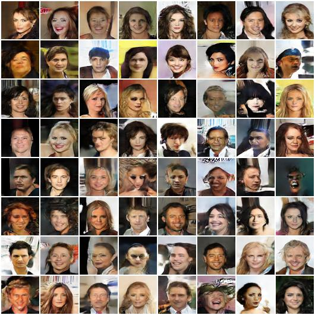
| 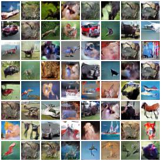
|===

=== GGAN
*_Geometric GAN_* +
_Jae Hyun Lim, Jong Chul Ye._ +
Arxiv 2017. [https://arxiv.org/abs/1705.02894[PDF]]

[cols="4*", options="header"] 
|===
^| Dataset
^| MNIST
^| CelebA
^| CIFAR10

^.^| Results
| 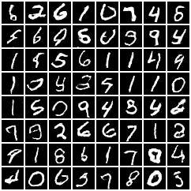
| 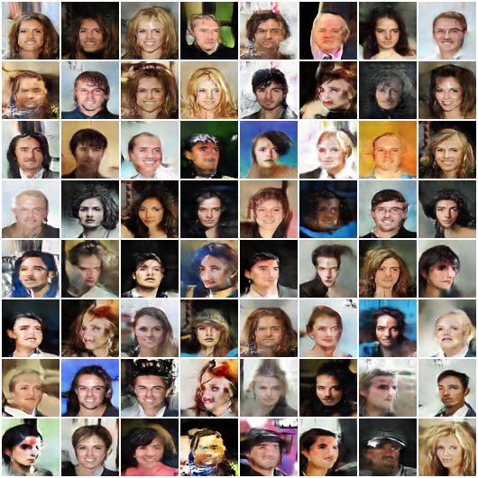
| 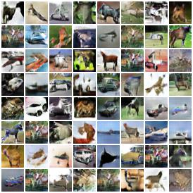
|===

== Variational Autoencoders(VAEs)

=== VAE
*_Auto-Encoding Variational Bayes._* +
Diederik P.Kingma, Max Welling. +
ICLR 2014. [https://arxiv.org/abs/1312.6114[PDF]]

[cols="4*", options="header"] 
|===
^| Dataset
^| MNIST
^| CelebA
^| CIFAR10

^.^| Results
| 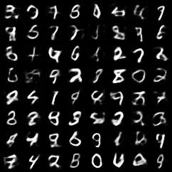
| 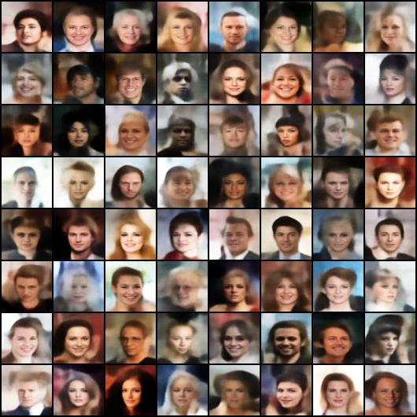
| 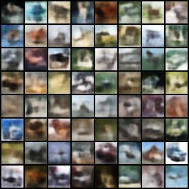
|===

=== Beta-VAE
*_beta-VAE: Learning Basic Visual Concepts with a Constrained Variational Framework_* +
Irina Higgins, Loic Matthey, Arka Pal, Christopher Burgess, Xavier Glorot, Matthew Botvinick, Shakir Mohamed, Alexander Lerchner. +
ICLR 2017. [https://openreview.net/forum?id=Sy2fzU9gl[PDF]]

[cols="3*", options="header"] 
|===
^| Dataset
^| CelebA
^| dsprites

^.^| Sample
| 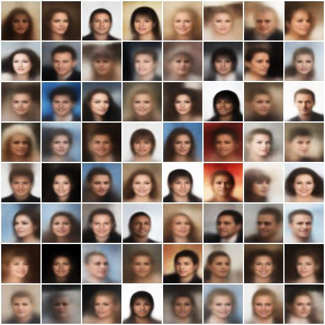
| 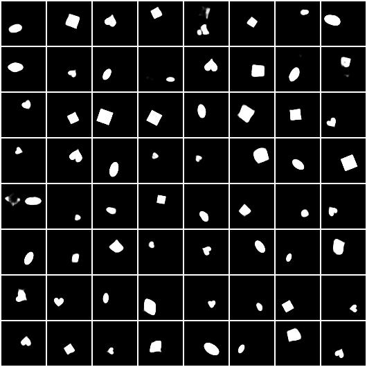

^.^| Latent Interpolation
| 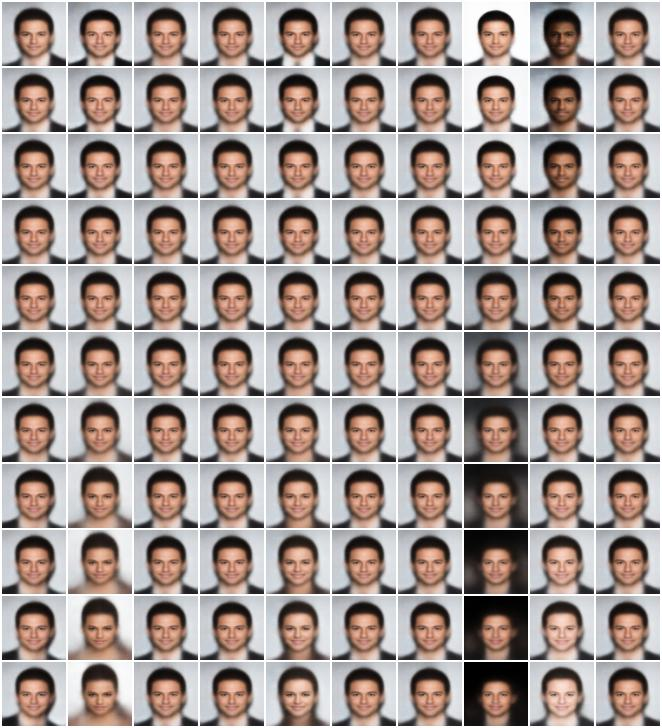
| 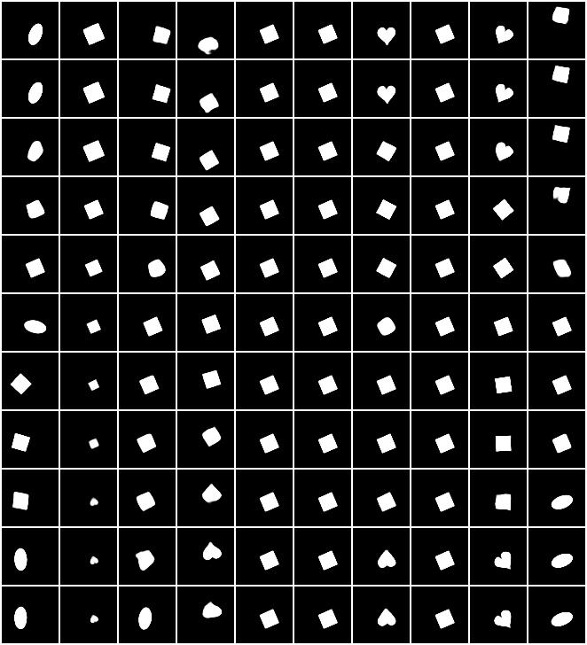
|===

=== Factor-VAE
*_Disentangling by Factorising_* +
Hyunjik Kim, Andriy Mnih. +
NeurIPS 2017. [https://arxiv.org/abs/1802.05983[PDF]]

[cols="3*", options="header"] 
|===
^| Dataset
^| CelebA
^| dsprites

^.^| Sample
| 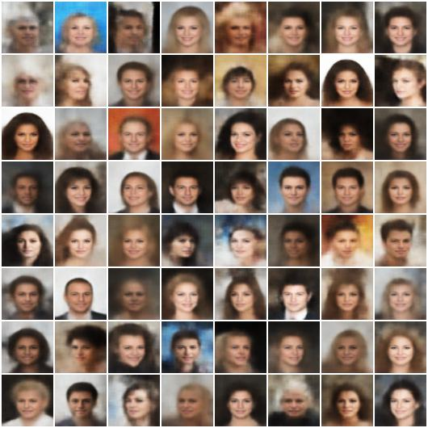
| 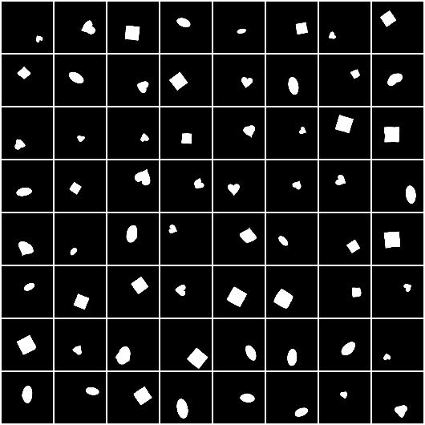

^.^| Latent Interpolation
| image:assets/factor_vae/fvae_celeba_traverse.jpg[celeba, {img-size}, {img-size}]
| 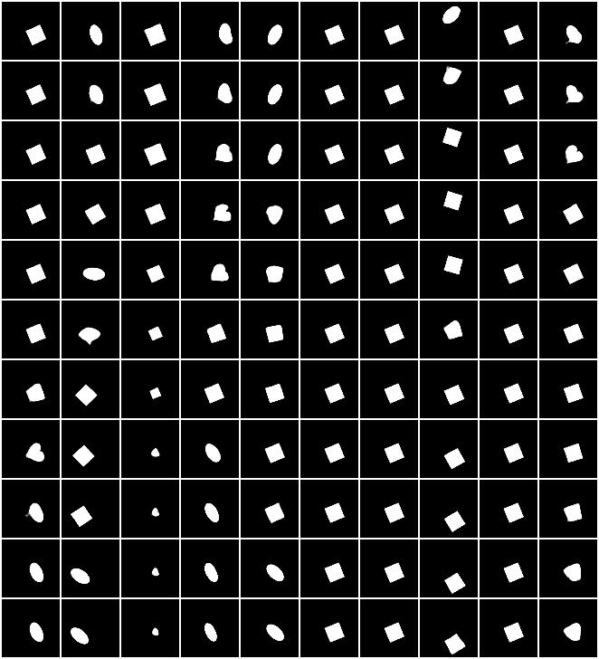
|===

=== AAE
*_Adversarial Autoencoders._* +
_Alireza Makhzani, Jonathon Shlens, Navdeep Jaitly, Ian Goodfellow, Brendan Frey._ +
arxiv 2015. [https://arxiv.org/abs/1511.05644[PDF]]

[cols="4*", options="header"] 
|===
^| Dataset
^| MNIST
^| CelebA
^| CIFAR10

^.^| Results
| 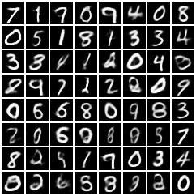
| 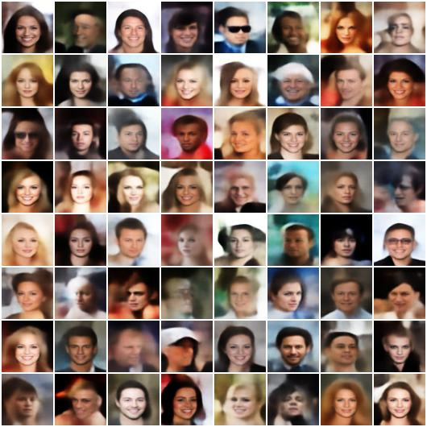
| 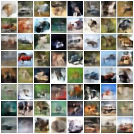
|===

=== AGE
`AGE` *_Adversarial Generator-Encoder Networks._* +
_Dmitry Ulyanov, Andrea Vedaldi, Victor Lempitsky._ +
AAAI 2018. [https://arxiv.org/abs/1704.02304[PDF]]

[cols="4*", options="header"] 
|===
^| Dataset
^| MNIST
^| CelebA
^| CIFAR10

^.^| Results
| 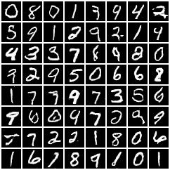
| TODO image:assets/age/celeba.jpg[cleba_conv, {img-size}, {img-size}]
| TODO image:assets/age/cifar10.jpg[cifar10_conv, {img-size}, {img-size}]
|===

== Augoregressive Models

=== PixelCNN
*_Conditional Image Generation with PixelCNN Decoders_* +
_Aaron van den Oord, Nal Kalchbrenner, Oriol Vinyals, Lasse Espeholt, Alex Graves, Koray Kavukcuoglu_
NeruIPS 2016. [https://arxiv.org/abs/1606.05328[PDF]]

[cols="2*", options="header"] 
|===
^| Dataset
^| MNIST

^.^| Samples
| 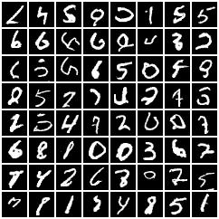

^.^| Class Condition Samples
| 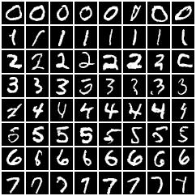
|===

== Diffusion Models
=== DDPM
