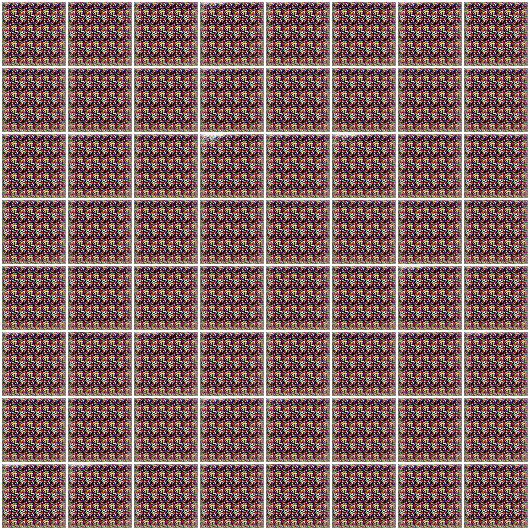
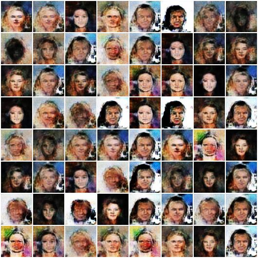
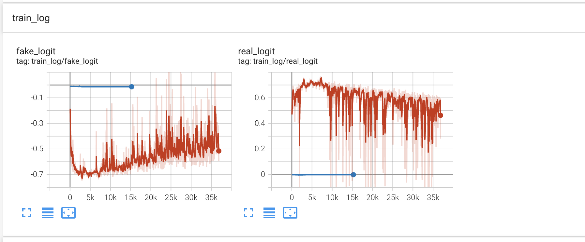

= 对WGAN中网络结构的敏感性分析(只因多加了一层conv layer, WGAN怎么都没有办法收敛!)

起因: 很久没有更新这个repo了，最近正好看了@苏剑林 关于WGAN的blog, 想对wgan的一些实验设置进行分析，然后重新跑了一遍wgan的实验，发现竟然无法复现出之前的结果，仔细对比了之前实验记录中lr、optmizer、clip_weight、n_critic等设置，及时全部对应也无法复现之前的结果，一度失去信心。

最后将代码checkout到原来的commit, 重新对比Training optimizer，weight clip，dataloader: (batch_size, transform)，Network architecture等，最后把network的代码copy过来，竟然work了！

而这个两种network的区别仅在于我后来为了提高网络复杂度，多加了一层conv layer，本以为一层网络不会影响训练稳定性的，但实际上差别非常大，原来的network能在10个epoch内生成有意义的图像，而加了一层conv layer之后需要1000 epochs才有概率生成有意义的图像。

== 网络结构对比分析

work版本的generator和discriminator:
----
Generator(
  (main): Sequential(
    (0): ConvTranspose2d(100, 512, kernel_size=(4, 4), stride=(1, 1), bias=False)
    (1): BatchNorm2d(512, eps=1e-05, momentum=0.1, affine=True, track_running_stats=True)
    (2): ReLU(inplace=True)
    (3): ConvTranspose2d(512, 256, kernel_size=(4, 4), stride=(2, 2), padding=(1, 1), bias=False)
    (4): BatchNorm2d(256, eps=1e-05, momentum=0.1, affine=True, track_running_stats=True)
    (5): ReLU(inplace=True)
    (6): ConvTranspose2d(256, 128, kernel_size=(4, 4), stride=(2, 2), padding=(1, 1), bias=False)
    (7): BatchNorm2d(128, eps=1e-05, momentum=0.1, affine=True, track_running_stats=True)
    (8): ReLU(inplace=True)
    (9): ConvTranspose2d(128, 64, kernel_size=(4, 4), stride=(2, 2), padding=(1, 1), bias=False)
    (10): BatchNorm2d(64, eps=1e-05, momentum=0.1, affine=True, track_running_stats=True)
    (11): ReLU(inplace=True)
    (12): ConvTranspose2d(64, 3, kernel_size=(4, 4), stride=(2, 2), padding=(1, 1), bias=False)
    (13): Tanh()
  )
)

Discriminator(
  (main): Sequential(
    (0): Conv2d(3, 64, kernel_size=(4, 4), stride=(2, 2), padding=(1, 1), bias=False)
    (1): LeakyReLU(negative_slope=0.2, inplace=True)
    (2): Conv2d(64, 128, kernel_size=(4, 4), stride=(2, 2), padding=(1, 1), bias=False)
    (3): BatchNorm2d(128, eps=1e-05, momentum=0.1, affine=True, track_running_stats=True)
    (4): LeakyReLU(negative_slope=0.2, inplace=True)
    (5): Conv2d(128, 256, kernel_size=(4, 4), stride=(2, 2), padding=(1, 1), bias=False)
    (6): BatchNorm2d(256, eps=1e-05, momentum=0.1, affine=True, track_running_stats=True)
    (7): LeakyReLU(negative_slope=0.2, inplace=True)
    (8): Conv2d(256, 512, kernel_size=(4, 4), stride=(2, 2), padding=(1, 1), bias=False)
    (9): BatchNorm2d(512, eps=1e-05, momentum=0.1, affine=True, track_running_stats=True)
    (10): LeakyReLU(negative_slope=0.2, inplace=True)
    (11): Conv2d(512, 1, kernel_size=(4, 4), stride=(1, 1), bias=False)
  )
)

----

修改之后，失败版本的generator和discriminator
----
Generator(
  (main): Sequential(
    (0): ConvTranspose2d(100, 512, kernel_size=(1, 1), stride=(1, 1))
    (1): BatchNorm2d(512, eps=1e-05, momentum=0.1, affine=True, track_running_stats=True)
    (2): ReLU(inplace=True)
    (3): ConvTranspose2d(512, 512, kernel_size=(4, 4), stride=(1, 1))
    (4): BatchNorm2d(512, eps=1e-05, momentum=0.1, affine=True, track_running_stats=True)
    (5): ReLU(inplace=True)
    (6): ConvTranspose2d(512, 256, kernel_size=(4, 4), stride=(2, 2), padding=(1, 1))
    (7): BatchNorm2d(256, eps=1e-05, momentum=0.1, affine=True, track_running_stats=True)
    (8): ReLU(inplace=True)
    (9): ConvTranspose2d(256, 128, kernel_size=(4, 4), stride=(2, 2), padding=(1, 1))
    (10): BatchNorm2d(128, eps=1e-05, momentum=0.1, affine=True, track_running_stats=True)
    (11): ReLU(inplace=True)
    (12): ConvTranspose2d(128, 64, kernel_size=(4, 4), stride=(2, 2), padding=(1, 1))
    (13): BatchNorm2d(64, eps=1e-05, momentum=0.1, affine=True, track_running_stats=True)
    (14): ReLU(inplace=True)
    (15): ConvTranspose2d(64, 3, kernel_size=(4, 4), stride=(2, 2), padding=(1, 1))
    (16): Tanh()
  )
)

Discriminator(
  (main): Sequential(
    (0): Conv2d(3, 64, kernel_size=(4, 4), stride=(2, 2), padding=(1, 1))
    (1): LeakyReLU(negative_slope=0.2, inplace=True)
    (2): Conv2d(64, 128, kernel_size=(4, 4), stride=(2, 2), padding=(1, 1))
    (3): BatchNorm2d(128, eps=1e-05, momentum=0.1, affine=True, track_running_stats=True)
    (4): LeakyReLU(negative_slope=0.2, inplace=True)
    (5): Conv2d(128, 256, kernel_size=(4, 4), stride=(2, 2), padding=(1, 1))
    (6): BatchNorm2d(256, eps=1e-05, momentum=0.1, affine=True, track_running_stats=True)
    (7): LeakyReLU(negative_slope=0.2, inplace=True)
    (8): Conv2d(256, 512, kernel_size=(4, 4), stride=(2, 2), padding=(1, 1))
    (9): BatchNorm2d(512, eps=1e-05, momentum=0.1, affine=True, track_running_stats=True)
    (10): LeakyReLU(negative_slope=0.2, inplace=True)
    (11): Conv2d(512, 512, kernel_size=(4, 4), stride=(1, 1))
    (12): BatchNorm2d(512, eps=1e-05, momentum=0.1, affine=True, track_running_stats=True)
    (13): LeakyReLU(negative_slope=0.2, inplace=True)
    (14): Conv2d(512, 1, kernel_size=(1, 1), stride=(1, 1))
  )
)
----

具体来说Generator区别在于将原来网络的
ConvTranspose2d(100, 512, kernel_size=(4, 4), stride=(1, 1), bias=False)
替换成了
ConvTranspose2d(100, 512, kernel_size=(1, 1), stride=(1, 1))
ConvTranspose2d(512, 512, kernel_size=(4, 4), stride=(1, 1))
两个layer

Discriminator将原来网络的最后一个Conv
(11): Conv2d(512, 1, kernel_size=(4, 4), stride=(1, 1), bias=False)
替换成了
(11): Conv2d(512, 512, kernel_size=(4, 4), stride=(1, 1))
(14): Conv2d(512, 1, kernel_size=(1, 1), stride=(1, 1))
两个Layer

同时分别单独替换Generator和Discriminator，发现替换Generator后仍然能够正常采样，但替换Discriminator后质量大幅下降。

[%header, cols=2*] 
|===
| 修改Discriminator
| 只修改Generator

| 
| 

|===

进一步，
Discriminator将原来网络的最后一个Conv
----
(11): Conv2d(512, 1, kernel_size=(4, 4), stride=(1, 1), bias=False)
----
重新替换成

----
(11): Conv2d(512, 1024, kernel_size=(4, 4), stride=(1, 1))
(14): Conv2d(1024, 1, kernel_size=(1, 1), stride=(1, 1))
----

两个Layer，也不管用

猜测: 具体原因应该跟weight cliping有关系

用修改后的discriminator搭配WGAN-GP，就可以正常训练，证明是weight clipping的问题

分析两种情况real 和 fake logits的分布:

发现ChangeD的情况下，出现了明显的gradient vanishing现象。

> 为什么正好加上这一层就会出现gradient vanishing呢？

// TOOD: 具体原因还没搞清楚 -> 深度学习的可解释性啊。。。

== 其他参数的敏感性分析:

. lr: 从1e-4到5e-5之间，效果差别不是很大
. optimizer:
    adam和rmsprop差距也不是很大
. 